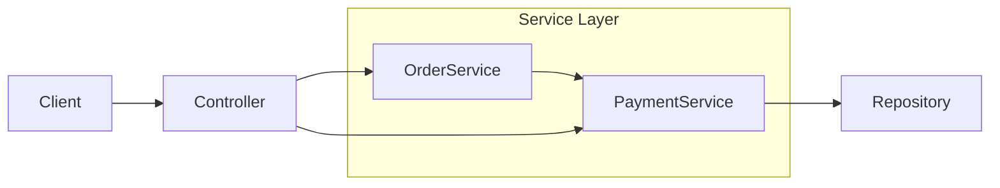

# Order & Payment System (Backend Service)

## 1. Problem Statement
 *This project is an Order–Payment service focused on managing the complete lifecycle of orders and payments. It robustly handles order state transitions, ensures data consistency during failure scenarios, and enforces business validations to prevent invalid data from entering the system.*

## 2. In Scope
- **Order Management**
- **Payment Management**

Scope includes **API design, implementation, and documentation only** (no UI).

Functional scope:
1. Create an order
2. Modify an order
3. Cancel an order
4. Allow payment for an order
5. Retry payment if order state is `PAYMENT_FAILED`
6. Local deployment and Docker deployment

---

## 3. Out of Scope
- Notifications
- Cart management
- Integration with external payment gateway
- Shipping management
- Cloud Integration and deployment
- Admin user modifying orders on behalf of users

## architecture

## 4. Order Lifecycle States
An order can exist in one of the following states:

- **CREATED** – Order successfully created
- **PAYMENT_IN_PROGRESS** – Payment has been initiated
- **PAYMENT_DONE** – Payment completed successfully
- **PAYMENT_FAILED** – Payment attempt failed
- **ORDER_CANCELLED** – Order cancelled by the user

---

## 5. State Transition Rules
- `CREATED → PAYMENT_IN_PROGRESS → PAYMENT_DONE`
- `CREATED → PAYMENT_IN_PROGRESS → PAYMENT_FAILED`
- `CREATED → ORDER_CANCELLED`

---

## 6. Failure Handling Rules
- **Payment failure**: 	On payment failure, the order state is updated to PAYMENT_FAILED to maintain consistency.
- **Duplicate orders**: The system prevents the creation of multiple orders for the same request.
- **Payment retry**: Duplicate payments are prevented when users retry or refresh during the payment process.

---

## 7. API List (Names Only)
- `POST/orders` – Create an order  
- `GET/orders/{id}` – Retrieve order details
- `PUT/orders/{id}` - Modify order details
- `POST/orders/{id}/cancel` – Cancels an order  
- `POST/payments` – Process payment for an order  
- `POST/payments/{id}/retry` – Retry payment for an order  
- `GET/payments/{paymentId}` – Retrieve payment details  

> No API versioning or advanced filtering in this phase.

---

## 8. Key Design Decisions
*For the current scope and to keep the implementation simple, the project starts with a monolithic architecture to establish a strong and maintainable foundation. As requirements evolve and the scope expands, the design allows a gradual transition toward a more modular or single-service–oriented architecture, enabling scalability and future enhancements without major rework.*

---

## 9. Non‑Goals
- High availability
- Horizontal scaling
- Distributed transactions
- Event-driven architecture
- External integrations
