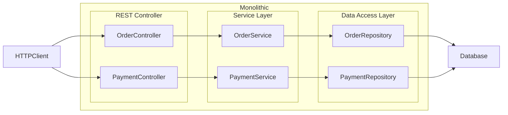

# Order & Payment System (Backend Service)

## 1. Problem Statement
*This project represents an Order–Payment service designed to manage the business lifecycle of customer orders and their associated payments in a controlled and consistent manner.
The system allows users to create, update, cancel, and view orders, while enforcing clear business rules that govern when an order can be modified.
The Payment service handles payment processing for orders, supports controlled retries for failed transactions, and ensures that duplicate payments are prevented.
Order and payment states are kept in sync to ensure the system never enters an inconsistent or ambiguous state.
All operations are validated against the current business status of the order and payment, and any action that violates defined business rules is explicitly rejected.
Overall, the service focuses on maintaining reliable order and payment lifecycles, safeguarding data consistency, and enforcing business correctness across all operations.*

## 2. In Scope
- **Order Management**
- **Payment Management**

Scope includes **API design, implementation, and documentation only** (no UI).

Functional scope:
1. Create an order
2. Modify an order
3. Cancel an order
4. Allow payment for an order
5. Retry payment
6. Local deployment and Docker deployment

---

## 3. Out of Scope
- Notifications
- Cart management
- Integration with external payment gateway
- Shipping management
- Cloud Integration and deployment
- Admin user modifying orders on behalf of users

## 4. High-Level Architecture


 *  Order module is responsible for 
 	-   Manage order state life cycle
 	-	Creating new order for user
 	-	Allow user to cancel an order
 	-	Allow user to modify an order if payment is not initated
 	- 	Retrive order details
 *  Payment module is responsible for 
 	-   Manage payment state life cycle.
 	-   coordinate with order to update order state if payment state is changed, keeping in sync both state.
 	-	Process payment for an order
 	-	Retry payment if payment is failed eariler
 	-	Retrive payment details
 * Interaction between Payment and Order module
 	Payment module interacts with order module 
 	-	In case of Payment is successful, payment module is responsible to update order status for payment success so that both are in sync.
 	-	In case of Payment is failed, payment module is responsible to update order status for payment failure so that both are in sync.
 	- 	Business validation for Payment module needs to interact with oder module to do validation.
 	- 	All communication between module is synchronus and happen in single transaction.
 * Data management model
 	- Single database architecture.
 	- All tables are logically separated for different modules in a single database and transaction tables would have shared data.
 * As this architecture is single database and monolith, it helps 
 	- consistenency in data especially maintaining status lifecycle for orders and payments. 
 	- automatic updates across order & payment.

## 5. Order Lifecycle States
An order can exist in one of the following states:
```mermaid
flowchart LR
	subgraph OrderLifeCycle["Overall Order Status Life Cycle"]
		CREATED --> PAYMENT_IN_PROGRESS
		PAYMENT_IN_PROGRESS --> PAYMENT_DONE
		PAYMENT_IN_PROGRESS -->  PAYMENT_FAILED
		PAYMENT_FAILED --> PAYMENT_DONE
		CREATED --> ORDER_CANCELLED
		PAYMENT_FAILED --> ORDER_CANCELLED

```

- **CREATED** – Order successfully created
- **PAYMENT_IN_PROGRESS** – Payment has been initiated
- **PAYMENT_DONE** – Payment completed successfully
- **PAYMENT_FAILED** – Payment attempt failed
- **ORDER_CANCELLED** – Order cancelled by the user

---

* System enforce order to prevent modification if its initiated payment.
* System enforce order to prevent cancellation if its payment is success.
* Order is allowed to cancel only if payment is not initiated.

## 6. Payment Flow & Idempotency
- An order is allow to process payment only if its payment was not initiated (order state is CREATED).
- For some reason if payment is failed, system marks payment as failed and also mark related order to failed (State - PAYMENT_FAILED)
- To avoid duplicate, system make sure an order have at most one success payment. While processing payment, it does validate status at order level and rejects payment if order status to be found as sucess (PAYMENT_DONE)
- In case of retry payement, system validates order level state and make sure its not succes payment (PAYMENT_DONE) 
- To check payment status, system always checks order level state as system is designed to have at most
- Payment failure is modeled as a state transition, not an exception. Both payment and order move to PAYMENT_FAILED atomically, which allows safe retries without recreating business intent.

```mermaid
flowchart LR
   CREATED --> PAYMENT_DONE
   PAYMENT_DONE
  subgraph Monolithic["Order Sucess"]
    subgraph Monolithic["Order Status"]
        CREATED
        PAYMENT_DONE
    end
    subgraph Monolithic["Payment Status"]
        PAYMENT_DONE
    end
end
```

```mermaid
flowchart LR
   CREATED --> PAYMENT_DONE
   PAYMENT_DONE
  subgraph Monolithic["Order Failed"]
    subgraph Monolithic["Order Status"]
        CREATED
        PAYMENT_FAILED
    end
    subgraph Monolithic["Payment Status"]
        PAYMENT_FAILED
    end
end
```

```mermaid
flowchart LR
   CREATED --> PAYMENT_FAILED
   PAYMENT_FAILED --> PAYMENT_DONE
  subgraph Monolithic["Order Retried"]
    subgraph Monolithic["Order Status"]
        CREATED
        PAYMENT_FAILED
        PAYMENT_DONE
    end
    subgraph Monolithic["Payment Status"]
        PAYMENT_FAILED
        PAYMENT_DONE
    end
end
```

## 7. Failure Handling
- **Payment failure**: 	If payment is failed for an order, then its payment entry is marked as PAYMENT_FAILED and marked that order to PAYMENT_FAILED.
System handles payment failure as state change and not throwing exception. Reason is system needs this record in the database as failed payment to modify it or retry it in the future. For the same reason, system keeps consistency between order and payment state and do this in single transaction. So if payment is failed, the order is not stuck in PAYMENT_IN_PROGRESS OR CREATED state, and transite to PAYMENT_FAILED state so that user is aware that order is failed for payment failure and needs to rety.
- **Duplicate orders**: The system prevents the creation of multiple orders for the same request.
- **Payment retry**: Duplicate payments are prevented when users retry or refresh during the payment process. Before proceeding to save any payment, system check if order's status is not PAYMENT_DONE and throws duplicate transaction validation message if it found payment is done. This guarantees that an order can have at most one one succesfull payment, regardless of how many retry attempts are made.


## 7. Error Handling Strategy.
-- System is uses centralized place to handle exception. It uses @ which is centralized place to convert domain exceptions into HTTP response. By using @RestControllerAdvice, controller, services are thing and focused purly on success path. There are no try/catch in every endpoint which would make code clutter with repetative error logic handling. @RestControllerAdvice allows me to centralize all error mapping in one place, ensuring every error response has the same consistent structure. My service throws domain specific exception without worrying about http response e.g OrderNotFoundException or DuplicatePayementException. The @RestControllerAdvice act as mapper that translates these domain exceptions into the correct HTTP status codes, E.g converting DuplicatePaymentException to 409 conflict and OrdeAlreadyCancelledException to 400 Bad request.

## 8. API List (Names Only)
- `POST/orders` – Create an order  
- `GET/orders/{id}` – Retrieve order details
- `PUT/orders/{id}` - Modify order details
- `POST/orders/{id}/cancel` – Cancels an order  
- `POST/payments` – Process payment for an order  
- `POST/payments/{id}/retry` – Retry payment for an order  
- `GET/payments/{paymentId}` – Retrieve payment details  

> No API versioning or advanced filtering in this phase.

---

## 9. Key Design Decisions
- *A monolith is choosen to prioritize transactional consistency. My core requirement was ensuing that Order and Payment status remain perfectly in sync. In a monolithic archicture, I can update both the Order and Payment entities  within a single ACID transaction, ensuing that we never have a "Paid" payment linked to a "Failed" order.*
- *A synchronous monolithic deisgn is choosen to prioritize transactional consistency. The goal of this project is to demonstrate backend engineering correctness, not infractructure configuration. Cloud deployment is an "environment concern," not a logic conern. By separating logic design from infrastucture wiring, I ensure the domain model is solid before adding deployment complexity.*
- * A deterministic failure simulation is choosen as random failure make system hard to test and demonstrate. I chose deterministic failure because my goal is prove I can handle the state transition and the recovery logic. System becomes testable, explanable and stable.


---

## 10. Non‑Goals
- High availability
- Horizontal scaling
- Distributed transactions
- Event-driven architecture
- External integrations
