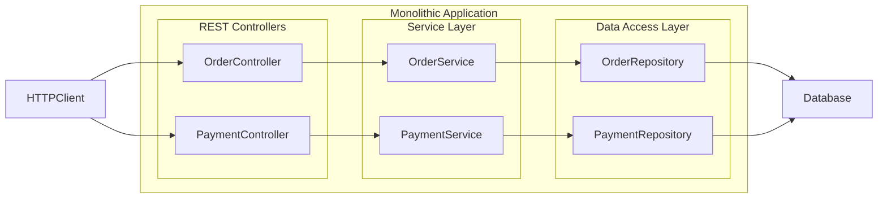
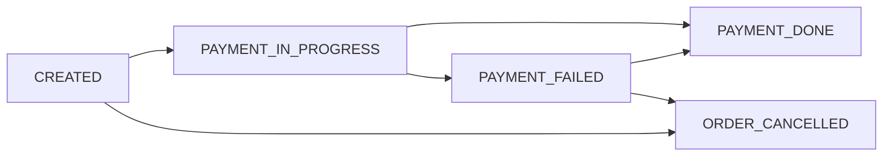
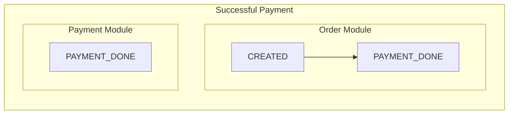
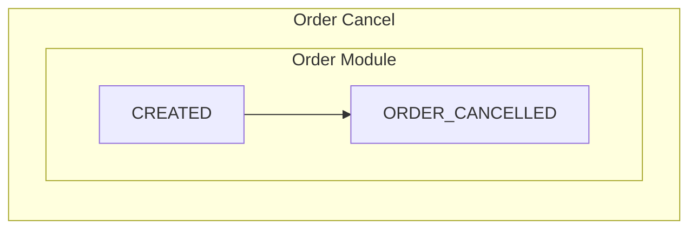
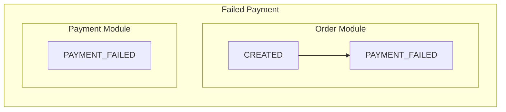
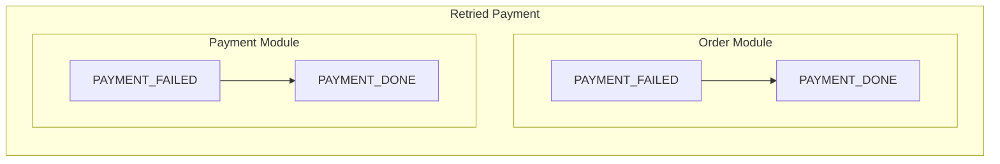

# Order & Payment System (Backend Service)

## 1. Problem Statement

*This project represents an Order–Payment backend service designed to manage the business lifecycle of customer orders and their associated payments in a controlled and consistent manner.*

The system allows users to create, update, cancel, and view orders while enforcing clear business rules that govern **when an order can be modified or cancelled**.

The Payment module handles payment processing for orders, supports controlled retries for failed transactions, and ensures that **duplicate payments are prevented**.
Order and payment states are kept in sync to ensure the system never enters an inconsistent or ambiguous state.

All operations are validated against the **current business state** of the order and payment, and any action that violates defined business rules is explicitly rejected.

Overall, the service focuses on:

* maintaining reliable order and payment lifecycles,
* safeguarding data consistency, and
* enforcing business correctness across all operations.

---

## 2. In Scope

* **Order Management**
* **Payment Management**

Scope includes **API design, implementation, and documentation only** (no UI).

Functional scope:

1. Create an order
2. Modify an order
3. Cancel an order
4. Process payment for an order
5. Retry payment
6. Local deployment and Docker deployment

---

## 3. Out of Scope

* Notifications
* Cart management
* Integration with external payment gateways
* Shipping management
* Cloud integration and deployment
* Admin users modifying orders on behalf of customers

---

## 4. High-Level Architecture

### Module Responsibilities

**Order Module**

* Manages the order lifecycle

  * Create a new order (status = `CREATED`)
  * Modify an order
  * Cancel an order (status = `ORDER_CANCELLED`)
  * Retrieve order details

**Payment Module**

* Manages the payment lifecycle

  * Process payment for an order
  * Retry a failed payment
  * Retrieve payment details
  * Communicate with the Order module to keep order and payment states in sync

**Interaction Between Order and Payment Modules**

* The Payment module interacts with the Order module to enforce business rules:

  * If payment succeeds, both Order and Payment transition to `PAYMENT_DONE`
  * If payment fails, both Order and Payment transition to `PAYMENT_FAILED`
  * To enforce validations such as duplicate payment prevention, the Payment module queries the Order module to determine the current order state
* All inter-module communication is **synchronous** and executed within a **single transaction**

**Data Management**

* The system follows a **single database architecture**

---

## 5. Order Lifecycle States

An order can exist in one of the following states:

### Order States

* **CREATED** – Order successfully created
* **PAYMENT_IN_PROGRESS** – Payment has been initiated
* **PAYMENT_DONE** – Payment completed successfully
* **PAYMENT_FAILED** – Payment attempt failed
* **ORDER_CANCELLED** – Order cancelled by the user

### Order Modification Rules

* An order **cannot be modified** once payment has been initiated
  (`PAYMENT_IN_PROGRESS`, `PAYMENT_DONE`, `PAYMENT_FAILED`)
* A cancelled order **cannot be modified**
* An order **cannot be cancelled** once payment is successful or in progress
* Duplicate cancellation requests are rejected
* An order may be cancelled **only if payment has not been initiated**

---

## 6. Payment Flow & Idempotency

* Payment can be initiated **only when the order state is `CREATED`**
* If payment fails:

  * Payment is marked as `PAYMENT_FAILED`
  * The associated order is also marked as `PAYMENT_FAILED`
* To prevent duplicate payments:

  * The system enforces that **an order can have at most one successful payment**
  * Before processing payment, the system validates the order state and rejects the request if the order is already `PAYMENT_DONE`
* During retry:

  * The system validates that the order is not already successfully paid
* Payment status checks are always performed at the **order level**, as the system guarantees only one successful payment per order
* Payment failure is modeled as a **state transition**, not an exception.
  Both Order and Payment transition to `PAYMENT_FAILED` atomically, allowing safe retries without recreating business intent.

### Successful Payment

### Order Cancel

### Failed Payment

### Retried Payment

---

## 7. Failure Handling

* **Payment failure**
  Payment failure is handled as a **state change**, not an exception.
  When payment fails:

  * Payment is marked as `PAYMENT_FAILED`
  * The corresponding order is also marked as `PAYMENT_FAILED`
  * Both updates occur within a single transaction

  This ensures the order never remains stuck in `CREATED` or `PAYMENT_IN_PROGRESS` and clearly communicates that payment retry is required.

* **Duplicate orders**
  The system prevents the creation of multiple orders for the same request.

* **Payment retry**
  Duplicate payments are prevented during retries or client refreshes.
  Before saving any payment, the system checks whether the order is already `PAYMENT_DONE` and rejects the operation if so.
  This guarantees that an order can have **at most one successful payment**, regardless of retry attempts.

---

## 8. Error Handling Strategy

The system uses a **centralized exception handling mechanism** via `@RestControllerAdvice`, which converts domain exceptions into HTTP responses.

By using `@RestControllerAdvice`:

* Controllers and services remain focused on the **success path**
* There are no repetitive `try/catch` blocks cluttering endpoint logic
* Error mapping is centralized, ensuring a **consistent response structure**

Services throw **domain-specific exceptions** (e.g., `OrderNotFoundException`, `DuplicatePaymentException`) without any concern for HTTP semantics.

The `@RestControllerAdvice` acts as a mapper that translates these domain exceptions into appropriate HTTP responses, for example:

* `DuplicatePaymentException` → **409 Conflict**
* `OrderAlreadyCancelledException` → **400 Bad Request**

---

## 9. API List (Names Only)

* `POST /orders` – Create an order
* `GET /orders/{id}` – Retrieve order details
* `PUT /orders/{id}` – Modify order details
* `POST /orders/{id}/cancel` – Cancel an order
* `POST /payments` – Process payment for an order
* `POST /payments/{id}/retry` – Retry payment
* `GET /payments/{paymentId}` – Retrieve payment details

> No API versioning or advanced filtering in this phase.

---

## 10. Key Design Decisions

* *A monolithic architecture was chosen to prioritize transactional consistency.
  The core requirement of this system is to ensure that Order and Payment states remain perfectly synchronized. In a monolith, both entities can be updated within a single ACID transaction, guaranteeing that a successful payment is never associated with a failed order.*

* *A synchronous monolithic design was intentionally selected to focus on backend correctness rather than infrastructure complexity.
  Cloud deployment is treated as an environment concern, not a domain concern. This separation ensures that the domain model and business logic are solid before introducing deployment-specific complexity.*

* *Deterministic failure simulation was chosen instead of random failures.
  Random failures make systems difficult to test and reason about. Deterministic failures allow the system to clearly demonstrate state transitions and recovery logic, making the system testable, explainable, and stable.*

---

## 11. Non-Goals

* High availability
* Horizontal scaling
* Distributed transactions
* Event-driven architecture
* External integrations

---

