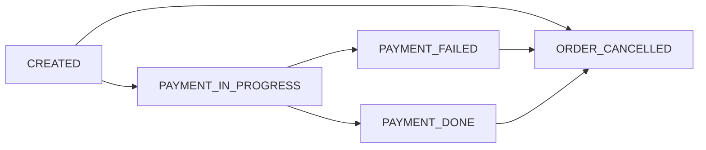

# Order & Payment System (Backend Service)

## 1. Problem Statement
*This project represents an Order–Payment service designed to manage the business lifecycle of customer orders and their associated payments in a controlled and consistent manner.
The system allows users to create, update, cancel, and view orders, while enforcing clear business rules that govern when an order can be modified.
The Payment service handles payment processing for orders, supports controlled retries for failed transactions, and ensures that duplicate payments are prevented.
Order and payment states are kept in sync to ensure the system never enters an inconsistent or ambiguous state.
All operations are validated against the current business status of the order and payment, and any action that violates defined business rules is explicitly rejected.
Overall, the service focuses on maintaining reliable order and payment lifecycles, safeguarding data consistency, and enforcing business correctness across all operations.*

## 2. In Scope
- **Order Management**
- **Payment Management**

Scope includes **API design, implementation, and documentation only** (no UI).

Functional scope:
1. Create an order
2. Modify an order
3. Cancel an order
4. Allow payment for an order
5. Retry payment if order state is `PAYMENT_FAILED`
6. Local deployment and Docker deployment

---

## 3. Out of Scope
- Notifications
- Cart management
- Integration with external payment gateway
- Shipping management
- Cloud Integration and deployment
- Admin user modifying orders on behalf of users

## 4. High-Level Architecture

 *  Order module is responsible for 
 	-	Creating new order for user
 	-	Allow user to cancel an order
 	-	Allow user to modify an order if payment is not initated
 	- 	Retrive order details
 *  Payment module is responsible for 
 	-	Process payment for an order
 	-	Retry payment if payment is failed eariler
 	-	Retrive payment details
 * Interaction between Payment and Order module
 	Payment module interacts with order module 
 	-	In case of Payment is successful, payment module is responsible to update order status for payment success so that both are in sync.
 	-	In case of Payment is failed, payment module is responsible to update order status for payment failure so that both are in sync.
 	- 	Business validation needs to interact with oder module to do validation.
 	- 	All communication between module is synchronus and happen in single transaction.
 * Data management model
 	- Single database architecture.
 	- All modules shares a single database.
 * As this architecture is single database and monolith, it helps 
 	- consistenency in data especially maintaining status lifecycle for orders and payments. 
 	- automatic updates across order & payment.

## 5. Order Lifecycle States
An order can exist in one of the following states:

- **CREATED** – Order successfully created
- **PAYMENT_IN_PROGRESS** – Payment has been initiated
- **PAYMENT_DONE** – Payment completed successfully
- **PAYMENT_FAILED** – Payment attempt failed
- **ORDER_CANCELLED** – Order cancelled by the user

---

## 6. State Transition Rules
- `CREATED → PAYMENT_IN_PROGRESS → PAYMENT_DONE`
- `CREATED → PAYMENT_IN_PROGRESS → PAYMENT_FAILED`
- `CREATED → ORDER_CANCELLED`

---

## 7. Failure Handling Rules
- **Payment failure**: 	On payment failure, the order state is updated to PAYMENT_FAILED to maintain consistency.
- **Duplicate orders**: The system prevents the creation of multiple orders for the same request.
- **Payment retry**: Duplicate payments are prevented when users retry or refresh during the payment process.

---

## 8. API List (Names Only)
- `POST/orders` – Create an order  
- `GET/orders/{id}` – Retrieve order details
- `PUT/orders/{id}` - Modify order details
- `POST/orders/{id}/cancel` – Cancels an order  
- `POST/payments` – Process payment for an order  
- `POST/payments/{id}/retry` – Retry payment for an order  
- `GET/payments/{paymentId}` – Retrieve payment details  

> No API versioning or advanced filtering in this phase.

---

## 9. Key Design Decisions
*For the current scope and to keep the implementation simple, the project starts with a monolithic architecture to establish a strong and maintainable foundation. As requirements evolve and the scope expands, the design allows a gradual transition toward a more modular or single-service–oriented architecture, enabling scalability and future enhancements without major rework.*

---

## 10. Non‑Goals
- High availability
- Horizontal scaling
- Distributed transactions
- Event-driven architecture
- External integrations
